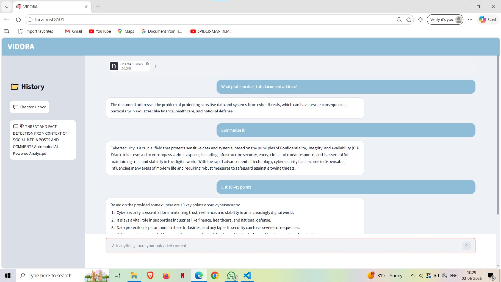
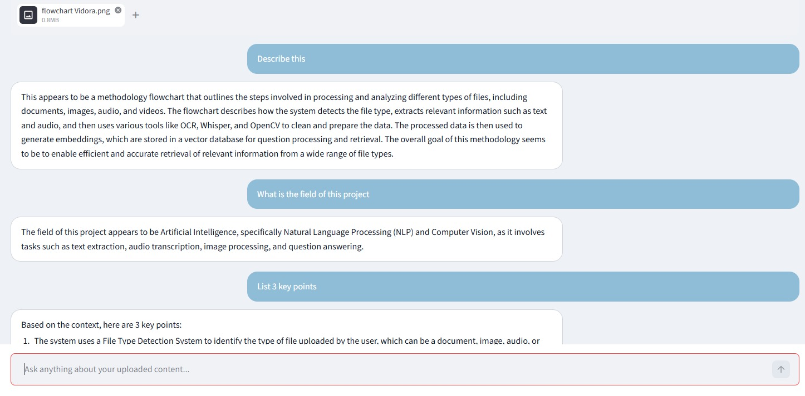
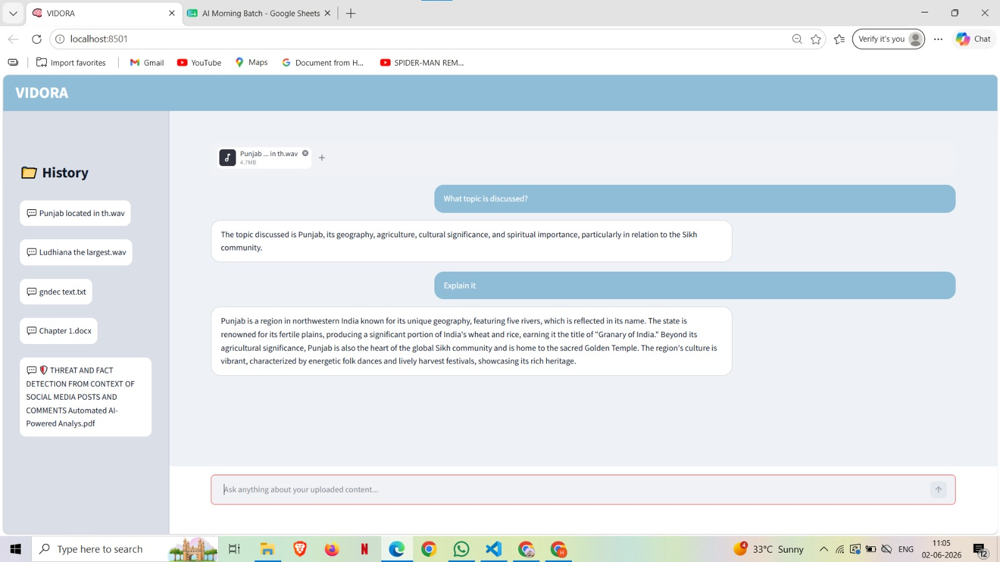

# VIDORA

## Multimodal Information Retrieval and Question Answering System

VIDORA is an AI-powered system that processes multiple types of input including documents, images, audio, and videos to provide context-aware answers. The system combines multimodal data processing with retrieval-based question answering to improve information access and understanding.

## Features

- Document Processing and Analysis
- Image Understanding and Analysis
- Audio Processing
- Video Processing
- Context-Aware Question Answering
- Multimodal Knowledge Retrieval

## Technologies Used

- Python
- Streamlit
- FAISS
- OCR/BLIP
- Whisper
- OpenCV
- LLM Integration and other libraries

## Project Structure

```text
app.py
audio_processor.py
chunking.py
doc_scan.py
embeddings.py
pdf_processor.py
qa_engine.py
validators.py
vector_store.py
video_frames.py
video_processor.py
vision_processor.py
requirements.txt
```

## Screenshots

### Home Screen


### Document Processing


### Image Processing


### Audio Processing


### Empty Document Validation


### No Audio in Video


### No Visual Content Detection


## How to Run

1. Install dependencies:
   ```bash
   pip install -r requirements.txt
   ```

2. Configure API key in `.env`

3. Run:
   ```bash
   streamlit run app.py
   ```

## Author

Hardeep Kaur  
B.Tech CSE 

## Training Project

Developed as a multimodal AI-based knowledge retrieval and question answering system.
